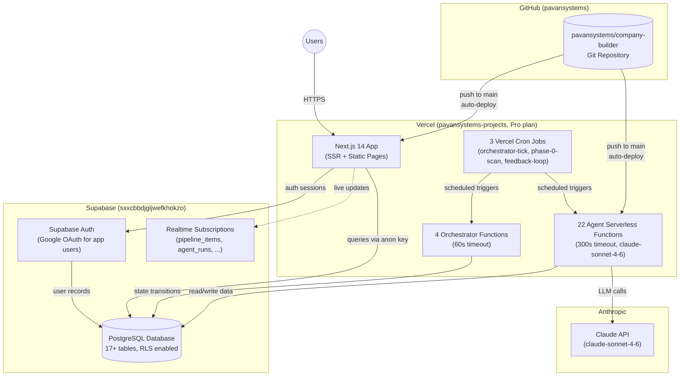
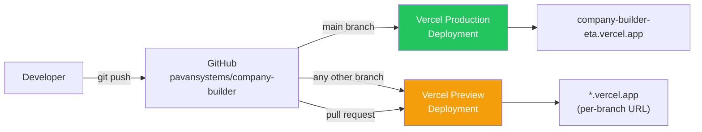
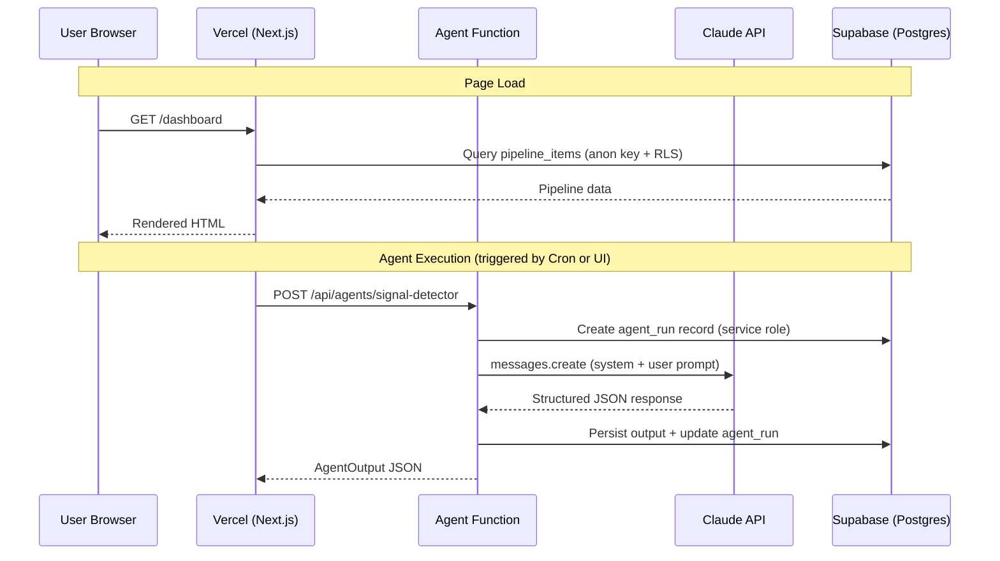
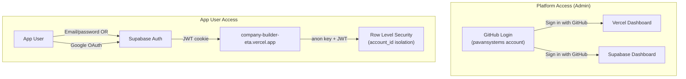

# Deployment Overview

This document describes how Company Builder is deployed, where each component runs, and how to perform future deployments.

---

## 1. Platform Accounts & Access

All platform accounts are accessed via the **pavansystems** GitHub account.

| Platform | Account / Team | Login Method | Dashboard URL |
|----------|---------------|--------------|---------------|
| **GitHub** | `pavansystems` | GitHub credentials | https://github.com/pavansystems/company-builder |
| **Vercel** | `pavansystems-projects` (Pro plan) | Sign in with GitHub (`pavansystems`) | https://vercel.com/pavansystems-projects/company-builder |
| **Supabase** | Project `sxxcbbdjgljwefkhokzo` | Sign in with GitHub (`pavansystems`) | https://supabase.com/dashboard/project/sxxcbbdjgljwefkhokzo |

**Key identifiers:**

| Resource | Value |
|----------|-------|
| Git repository | `github.com/pavansystems/company-builder` |
| Vercel team ID | `team_3K3GG0axexV0KBNiM6eCvlsG` |
| Vercel project ID | `prj_1H1UP5GGMwVbwqNOuq0cyqi4TmjU` |
| Supabase project ref | `sxxcbbdjgljwefkhokzo` |
| Supabase URL | `https://sxxcbbdjgljwefkhokzo.supabase.co` |
| Live app URL | `https://company-builder-eta.vercel.app` |

---

## 2. Architecture Diagrams

### 2.1 High-Level Deployment Overview



### 2.2 CI/CD Pipeline



### 2.3 Request & Data Flow



### 2.4 Cron & Agent Pipeline

```mermaid
flowchart TD
    subgraph "Vercel Cron Scheduler"
        C1["orchestrator-tick<br/>Every minute"]
        C2["phase-0-scan<br/>Every hour"]
        C3["feedback-loop<br/>Every Sunday"]
    end

    C1 -->|"advance pipeline items"| ORCH["Orchestrator Service"]
    C2 -->|"trigger Phase 0 chain"| P0

    subgraph P0["Phase 0: Discovery"]
        SS["source-scanner"] --> SD["signal-detector"]
        SD --> MC["market-classifier"]
        MC --> OR["opportunity-ranker"]
        OR --> WP["watchlist-publisher"]
    end

    ORCH -->|"when Phase 0 done"| P1
    subgraph P1["Phase 1: Ideation"]
        LA["landscape-analyst"] --> PE["pain-extractor"]
        PE --> CG["concept-generator"]
        CG --> CS["concept-scorer"]
        CS --> CSL["concept-selector"]
    end

    ORCH -->|"when Phase 1 done + gate pass"| P2
    subgraph P2["Phase 2: Validation"]
        MS["market-sizer"] --> CA["competitive-analyst"]
        CA --> CV["customer-validator"]
        CV --> FA["feasibility-assessor"]
        FA --> EM["economics-modeler"]
        EM --> VS["validation-synthesizer"]
    end

    ORCH -->|"when Phase 2 done + gate pass"| P3
    subgraph P3["Phase 3: Blueprint"]
        BD["business-designer"] --> AA["agent-architect"]
        AA --> GS["gtm-strategist"]
        GS --> RA["risk-analyst"]
        RA --> RP["resource-planner"]
        RP --> BP["blueprint-packager"]
    end

    C3 -->|"weekly optimization"| FL["Feedback Loop Service"]
    FL -->|"update scoring models"| SUPABASE[("Supabase")]

    P0 --> SUPABASE
    P1 --> SUPABASE
    P2 --> SUPABASE
    P3 --> SUPABASE
```



### 2.5 Authentication Flow



---

## 3. What Runs Where

### Vercel

| Component | Count | Timeout | Description |
|-----------|-------|---------|-------------|
| Next.js App (SSR) | 1 | default | Pages, layouts, route groups |
| Agent Functions | 22 | 300s (5 min) | AI agent endpoints (`/api/agents/*`) |
| Orchestrator Functions | 4 | 60s (1 min) | Pipeline state management (`/api/services/orchestrator/*`) |
| Cron: orchestrator-tick | 1 | 60s | Runs every minute — advances pipeline items |
| Cron: phase-0-scan | 1 | 300s | Runs every hour — triggers discovery pipeline |
| Cron: feedback-loop | 1 | 300s | Runs every Sunday at midnight — weekly optimization |
| Static Assets | - | CDN | `/public/`, CSS, JS bundles |

### Supabase

| Component | Details |
|-----------|---------|
| PostgreSQL Database | 17+ tables across 13 migrations (001–013) |
| Row Level Security | All tables enforce `account_id` isolation |
| Auth | Google OAuth + email/password for app users |
| Realtime | Subscriptions on `pipeline_items`, `agent_runs`, `gate_decisions`, `user_annotations`, `watchlist_versions` |

### External Services

| Service | Purpose |
|---------|---------|
| Anthropic Claude API | LLM calls from all 22 agents (model: `claude-sonnet-4-6`) |
| GitHub | Source code repository + SSO for platform access |

---

## 4. Environment Variables

All environment variables are configured in the **Vercel project settings** (Settings > Environment Variables).

### Public Variables (exposed to browser)

| Variable | Value | Purpose |
|----------|-------|---------|
| `NEXT_PUBLIC_SUPABASE_URL` | `https://sxxcbbdjgljwefkhokzo.supabase.co` | Supabase API endpoint |
| `NEXT_PUBLIC_SUPABASE_ANON_KEY` | `eyJ...` (JWT) | Supabase anonymous key (RLS-gated) |
| `NEXT_PUBLIC_APP_URL` | `https://company-builder-eta.vercel.app` | App base URL |

### Server-Only Variables (never sent to browser)

| Variable | Purpose |
|----------|---------|
| `SUPABASE_SERVICE_ROLE_KEY` | Full database access for agents and cron jobs |
| `ANTHROPIC_API_KEY` | Claude API authentication |
| `CRON_SECRET` | Bearer token for Vercel cron job authentication |

### How to Add or Rotate Variables

1. Go to https://vercel.com/pavansystems-projects/company-builder/settings/environment-variables
2. Add/update the variable for the relevant environment (Production, Preview, Development)
3. **Redeploy** to pick up changes: push a commit or run `vercel --prod` from CLI

---

## 5. Deployment Instructions

### 5.1 Routine Deployment (most common)

Merging to `main` triggers an automatic production deployment:

```bash
git checkout main
git merge your-feature-branch
git push origin main
# Vercel auto-deploys within ~60 seconds
```

Monitor the deployment at: https://vercel.com/pavansystems-projects/company-builder/deployments

### 5.2 Preview Deployments

Any push to a non-main branch or any pull request automatically gets a preview deployment with a unique URL.

```bash
git push origin feature/my-change
# Vercel creates: https://company-builder-<hash>-pavansystems-projects.vercel.app
```

### 5.3 Manual Deployment via CLI

```bash
# Install Vercel CLI (if not already)
npm i -g vercel

# From the codebase/ directory:
cd codebase

# Deploy to preview
vercel

# Deploy to production
vercel --prod
```

### 5.4 Database Migrations

Migrations are in `packages/database/migrations/` and numbered 001–013. They must be run manually against Supabase.

**Run via Supabase Dashboard (SQL Editor):**

1. Go to https://supabase.com/dashboard/project/sxxcbbdjgljwefkhokzo/sql
2. Open the migration file (e.g., `014_new_table.sql`)
3. Paste the SQL and click **Run**

**Run via Supabase CLI:**

```bash
# Install Supabase CLI
npm i -g supabase

# Link to the project
supabase link --project-ref sxxcbbdjgljwefkhokzo

# Apply pending migrations
supabase db push
```

### 5.5 Initial Setup (from scratch)

If you ever need to set up a new environment:

**1. Create Supabase project:**
- Go to https://supabase.com and sign in with the `pavansystems` GitHub account
- Create a new project, note the URL and keys
- Run all migrations (001–013) in order via the SQL Editor

**2. Configure Supabase Auth:**
- In Supabase Dashboard > Authentication > Providers
- Enable Google OAuth provider (configure with Google Cloud OAuth credentials)
- Set redirect URL to `https://<your-vercel-url>/auth/callback`

**3. Create Vercel project:**
- Go to https://vercel.com and sign in with the `pavansystems` GitHub account
- Import the `pavansystems/company-builder` repository
- Set the root directory to `codebase`
- Set Framework Preset to **Next.js**

**4. Configure environment variables in Vercel:**
- `NEXT_PUBLIC_SUPABASE_URL` — from Supabase project settings
- `NEXT_PUBLIC_SUPABASE_ANON_KEY` — from Supabase project settings > API
- `SUPABASE_SERVICE_ROLE_KEY` — from Supabase project settings > API (keep secret)
- `ANTHROPIC_API_KEY` — from https://console.anthropic.com
- `NEXT_PUBLIC_APP_URL` — your Vercel deployment URL
- `CRON_SECRET` — generate a random string (e.g., `openssl rand -hex 32`)

**5. Deploy:**
- Push to `main` or click "Deploy" in Vercel dashboard

### 5.6 Rollback

To roll back a production deployment:

1. Go to https://vercel.com/pavansystems-projects/company-builder/deployments
2. Find the last known good deployment
3. Click the three-dot menu > **Promote to Production**
4. Traffic switches immediately (zero downtime)

---

## 6. Cron Jobs

| Job | Schedule | Endpoint | Timeout | Purpose |
|-----|----------|----------|---------|---------|
| Orchestrator Tick | `* * * * *` (every minute) | `/api/cron/orchestrator-tick` | 60s | Advances pipeline items through phases, checks gates |
| Phase 0 Scan | `0 * * * *` (every hour) | `/api/cron/phase-0-scan` | 300s | Triggers the discovery pipeline (source scanning, signal detection, classification, ranking) |
| Feedback Loop | `0 0 * * 0` (Sundays midnight) | `/api/cron/feedback-loop` | 300s | Weekly optimization — analyzes outcomes, updates scoring models |

All cron endpoints are protected by the `CRON_SECRET` bearer token. Vercel automatically includes this header when invoking cron jobs.

Cron configuration is defined in `codebase/vercel.json`.

---

## 7. Monitoring & Troubleshooting

### Vercel Logs

- **Dashboard**: https://vercel.com/pavansystems-projects/company-builder > Logs tab
- **CLI**: `vercel logs --scope=pavansystems-projects` (streams real-time)
- **Filter by route**: Use the dashboard filter to isolate `/api/agents/*` or `/api/cron/*`

### Supabase Monitoring

- **Database**: https://supabase.com/dashboard/project/sxxcbbdjgljwefkhokzo/editor
- **Agent runs table**: Query `agent_runs` to see execution history, costs, and errors
- **Auth logs**: Authentication > Logs in Supabase dashboard

### Common Issues

| Issue | Diagnosis | Fix |
|-------|-----------|-----|
| Agent returns 401 | Missing or invalid `CRON_SECRET` or user not authenticated | Verify env var in Vercel settings; check Supabase Auth |
| Agent times out | LLM call taking too long | Check Anthropic API status; the 300s timeout is the max |
| Deployment fails | Build error | Check Vercel deployment logs; run `npm run build` locally to reproduce |
| Database RLS error | Missing `account_id` in query | Ensure the user JWT includes account_id; check RLS policies |
| Cron not firing | Vercel cron misconfiguration | Verify `vercel.json` cron entries; check Vercel > Cron tab |

### Useful SQL Queries

**Recent agent runs:**
```sql
SELECT agent_name, status, cost_usd, execution_duration_seconds, started_at
FROM agent_runs
ORDER BY started_at DESC
LIMIT 20;
```

**Agent error rate (last 24h):**
```sql
SELECT agent_name,
       COUNT(*) AS total,
       COUNT(*) FILTER (WHERE status = 'failed') AS failed,
       ROUND(COUNT(*) FILTER (WHERE status = 'failed')::numeric / COUNT(*)::numeric * 100, 1) AS error_pct
FROM agent_runs
WHERE started_at > NOW() - INTERVAL '24 hours'
GROUP BY agent_name
ORDER BY error_pct DESC;
```

**Total cost (last 30 days):**
```sql
SELECT SUM(cost_usd) AS total_cost,
       agent_name,
       SUM(cost_usd) AS agent_cost
FROM agent_runs
WHERE started_at > NOW() - INTERVAL '30 days'
GROUP BY agent_name
ORDER BY agent_cost DESC;
```
